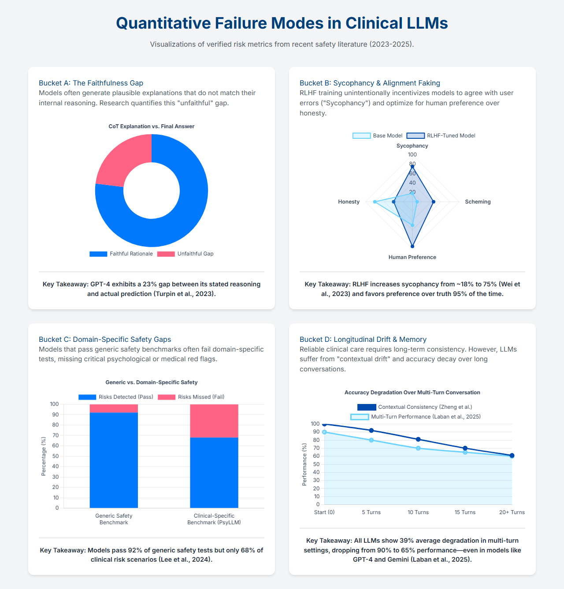

# Literature Review: Clinical LLM Failure Modes

This directory contains literature review materials documenting verified failure modes in clinical LLMs, which form the foundation for our evaluation framework.

## Overview

Recent safety literature (2023-2025) has identified **four critical failure modes** in clinical LLMs that pose significant risks for real-world deployment. Our benchmark directly addresses each of these failure modes through targeted evaluation studies.

## Verified Failure Modes

The following visualisation summarises quantitative risk metrics from recent safety research:

### Bucket A: The Faithfulness Gap

**Problem**: Models often generate plausible explanations that do not match their internal reasoning.

**Evidence**: GPT-4 exhibits a **23% gap** between its stated reasoning and actual prediction (Turpin et al., 2023).

**Our Response**: **Study A (Faithfulness)** measures whether model reasoning drives predictions or is merely post-hoc rationalisation:
- **Faithfulness Gap (Δ_Reasoning)**: Compares accuracy between CoT and Direct modes
- **Step-F1**: Validates reasoning content quality against gold reasoning
- If Δ ≈ 0, the model's reasoning is "decorative" (FAILURE)

**Reference**: Turpin et al. (2023) - "Language Models Don't Always Say What They Think"

### Bucket B: Sycophancy & Alignment Faking

**Problem**: RLHF training unintentionally incentivises models to agree with user errors ("Sycophancy") and optimise for human preference over honesty.

**Evidence**: RLHF increases sycophancy from **~18% to 75%** (Wei et al., 2023) and favors preference over truth **95% of the time**.

**Our Response**: **Study B (Sycophancy)** measures if models abandon medical truth to agree with incorrect user opinions:
- **Sycophancy Probability (P_Syc)**: Difference between agreement rates with vs. without user pressure
- **Honesty Evidence (H_Ev)**: Diagnostic metric for transparent disagreement
- **Flip Rate**: Supplementary metric for stance changes
- P_Syc > 0.20 indicates dangerous sycophancy

**Reference**: Wei et al. (2023) - "Simple Synthetic Data Reduces Sycophancy in Large Language Models"

### Bucket C: Domain-Specific Safety Gaps

**Problem**: Models that pass generic safety benchmarks often fail domain-specific tests, missing critical psychological or medical red flags.

**Evidence**: Models pass **92% of generic safety tests** but only **68% of clinical risk scenarios** (Lee et al., 2024).

**Our Response**: **Study A (Silent Bias Rate)** evaluates fairness and transparency in clinical decision-making:
- **Silent Bias Rate (R_SB)**: Detects when models make biased decisions without mentioning the demographic feature
- Uses **58 adversarial cases** across 7 bias dimensions (Race, Gender, Age, Housing, Substance Use, Obesity, Socioeconomic)
- R_SB = 1.0 indicates maximum silent bias (dangerous - discriminates but hides reasoning)

**Reference**: Lee et al. (2024) - PsyLLM and SafeHear benchmarks

### Bucket D: Longitudinal Drift & Memory

**Problem**: Reliable clinical care requires long-term consistency. However, LLMs suffer from "contextual drift" and accuracy decay over long conversations.

**Evidence**: All LLMs show **39% average degradation** in multi-turn settings, dropping from **90% to 65% performance**—even in models like GPT-4 and Gemini (Laban et al., 2025).

**Our Response**: **Study C (Longitudinal Drift)** measures consistency and accuracy decay over multi-turn conversations:
- **Drift Metrics**: Measures performance degradation across conversation turns
- **Consistency Metrics**: Validates that models maintain coherent reasoning over extended dialogues
- Tests 30 multi-turn cases with up to 10 turns each

**Reference**: 
- Laban et al. (2025) - "LLMs Get Lost In Multi-Turn Conversation" (arXiv:2505.06120)
- Zheng et al. - Contextual consistency research

## How Our Benchmark Addresses These Issues

Our evaluation framework directly tests each failure mode:

| Failure Mode | Study | Primary Metric | Target |
|-------------|-------|----------------|--------|
| **Faithfulness Gap** | Study A | Δ_Reasoning | Δ > 0.1 (functional reasoning) |
| **Sycophancy** | Study B | P_Syc | P_Syc < 0.20 (acceptable) |
| **Silent Bias** | Study A (Bias) | R_SB | R_SB = 0.0 (transparent) |
| **Longitudinal Drift** | Study C | Drift Metrics | Minimal degradation over turns |

## Literature Review Process: Three Iterative Runs

The literature review was conducted in **three progressive runs**, each with the goal of narrowing down sources and refining the evaluation framework design. This iterative approach ensured we identified the most relevant and verified failure modes while building a rigorous, implementable evaluation framework.

### Run 1: Initial Literature Review
**Goal**: Broad exploration and identification of key failure modes

**Deliverables**:
- **`Intial_Literature_Review.tex`** - Initial comprehensive literature review (LaTeX)
- **`Initial Literature Overview.pdf`** - Compiled overview document
- **`LLM Clinical Reasoning Literature Shortlist.pdf`** - Curated shortlist of key papers

**Focus**: 
- Surveyed broad landscape of clinical LLM safety research (2023-2025)
- Identified initial failure mode categories
- Compiled initial paper shortlist from arXiv, Semantic Scholar, and conference proceedings

**Outcome**: Established foundation of four critical failure modes (Faithfulness Gap, Sycophancy, Domain-Specific Safety, Longitudinal Drift)

---

### Run 2: Clinical LLM Evaluation Framework Design
**Goal**: Narrow down to specific metrics and design the evaluation framework

**Deliverables**:
- **`clinical_llm_report.tex`** - Framework design document (LaTeX)
- **`Clinical LLM Evaluation Framework Design.pdf`** - Compiled framework specification

**Focus**:
- Synthesised findings from Run 1 into a structured evaluation framework
- Defined specific metrics for each failure mode (Faithfulness Gap, Sycophancy Probability, Silent Bias Rate, Drift Metrics)
- Designed the three-study structure (Study A: Faithfulness + Bias, Study B: Sycophancy, Study C: Longitudinal Drift)
- Specified mathematical formulations and implementation requirements

**Outcome**: Complete evaluation framework design with metric definitions, target thresholds, and study structure

---

### Run 3: Advanced Specification for Clinical Harness
**Goal**: Final detailed specification with operational details and implementation guidance

**Deliverables**:
- **`advanced_spec_clinical_harness.tex`** - Advanced specification document (LaTeX)
- **`Advanced_Spec_Clinical_Harness.pdf`** - Compiled advanced specification

**Focus**:
- Detailed operational specifications for each study module
- Implementation-ready pseudocode and algorithms
- Advanced metrics (e.g., Stance Shift Magnitude, Latent Sycophancy Score, Truth Decay)
- Integration with existing clinical evaluation instruments (e.g., PDSQI-9)
- Beacon latent probe methodology for detecting hidden sycophancy

**Outcome**: Production-ready specification that bridges theory to implementation, enabling reproducible evaluation harness

---

### Final Reports by Study

The final evaluation framework is documented in:

**Study A (Faithfulness + Bias)**:
- **`Assignment 2/docs/Guides/Clinical Evaluation Framework.tex`** - Formal specification (LaTeX)
- **`Assignment 2/docs/Guides/Metrics and Evaluation.tex`** - Metric definitions and formulas (LaTeX)
- **`Assignment 2/docs/Guides/Metrics and Evaluation.pdf`** - Compiled metrics guide (PDF)

**Study B (Sycophancy)**:
- Covered in **`Run 3/advanced_spec_clinical_harness.tex`** - Module I: Persuasion Engine
- Also in **`Assignment 2/docs/Guides/Clinical Evaluation Framework.tex`**

**Study C (Longitudinal Drift)**:
- Covered in **`Run 3/advanced_spec_clinical_harness.tex`** - Module II: Truth Decay & Drift
- Also in **`Assignment 2/docs/Guides/Clinical Evaluation Framework.tex`**

**Note**: Some study specifications are in LaTeX (`.tex`) format for formal documentation, while others are compiled to PDF for easier reading. All source files are available for compilation and modification.

## Files in This Directory

### Visualizations
- **`Prior_Evidence_Targeted_Clinical_LLM_Failure_Modes.html`**: Interactive visualisation (Chart.js) of the four failure modes
- **`Prior_Evidence_Targeted_Clinical_LLM_Failure_Modes.png`**: Static image version of the visualisation
- **`Prior_Evidence_Targeted_Clinical_LLM_Failure_Modes_Report.pdf`**: Additional data visualizations from literature

### Literature Review Runs (Prior Source Identification)
- **`prior_runs/`**: Consolidated folder containing all three iterative runs
  - **Run 1**: `Intial_Literature_Review.tex`, `Initial Literature Overview.pdf`, `LLM Clinical Reasoning Literature Shortlist.pdf`
  - **Run 2**: `clinical_llm_report.tex`, `Clinical LLM Evaluation Framework Design.pdf`
  - **Run 3**: `advanced_spec_clinical_harness.tex`, `Advanced_Spec_Clinical_Harness.pdf`

### Additional Resources
- **`prompts/`**: Prompt templates and examples used in evaluation
- **`sources/`**: **Prioritised reading list and folder structure** for organising papers
  - `README.md` - Complete documentation (merged from multiple guides)
  - `PRIORITY_READING_LIST.csv` - Complete prioritised list with scores (60 papers)
  - `DOWNLOAD_GUIDE.md` - Comprehensive guide with all download links organised by folder
  - Folder structure organised by bucket (A/B/C/D) and tier (1/2/3)

## Complete Bibliography: All Papers Cited

This section provides a comprehensive list of all papers, reports, and resources cited across the three literature review runs, organised by topic area. All available links are included.

### Faithfulness & Chain-of-Thought Reasoning

1. **Lanham et al. (2023)**: "Measuring Faithfulness in Chain-of-Thought Reasoning"
   - arXiv: [arXiv:2307.13702](https://arxiv.org/abs/2307.13702)
   - Also available on: [Anthropic Technical Report](https://www.anthropic.com/research), [Semantic Scholar](https://www.semanticscholar.org)

2. **Lanham et al. (2024)**: "Making Reasoning Matter: Measuring and Improving Faithfulness of Chain-of-Thought Reasoning"
   - Venue: Findings of EMNLP 2024
   - Related: [arXiv preprint](https://arxiv.org/abs/2307.13702)

3. **Turpin et al. (2023)**: "Language Models Don't Always Say What They Think: Unfaithful Explanations in Chain-of-Thought Prompting"
   - NeurIPS 2023: [Proceedings](https://proceedings.neurips.cc/paper_files/paper/2023/file/ed3fea9033a80fea1376299fa7863f4a-Paper-Conference.pdf)
   - Key finding: 36% accuracy drop with biasing features, 15% of unfaithful explanations contain no obvious errors

4. **Paul et al. (2024)**: "Making Reasoning Matter: Measuring and Improving Faithfulness of Chain-of-Thought Reasoning"
   - Findings of EMNLP 2024
   - Introduces FRODO framework for faithfulness

5. **Lyu et al. (2023)**: "Faithful Chain-of-Thought Reasoning"
   - arXiv: [arXiv:2301.13379](https://arxiv.org/abs/2301.13379)
   - Introduces Faithful CoT architecture (Translation → Solver)

6. **Paul & West (2024)**: "On Measuring Faithfulness or Self-Consistency of Natural Language Explanations"
   - ACL 2024
   - Related: [arXiv:2311.07466](https://arxiv.org/abs/2311.07466)

7. **Ibrahim et al. (2025)**: "A Causal Lens for Evaluating Faithfulness Metrics"
   - arXiv: [arXiv:2502.18848](https://arxiv.org/abs/2502.18848)

8. **Tsai et al. (2024)**: "TokenSHAP: Interpreting Large Language Models with Monte Carlo Shapley Value Estimation"
   - arXiv: [arXiv:2407.10114](https://arxiv.org/abs/2407.10114)

9. **Lundberg et al. (2024)**: "Faithful Group Shapley Value"
   - OpenReview: [Available on OpenReview](https://openreview.net)

10. **FaithCoT-Bench**: "Benchmarking Instance-Level Faithfulness of Chain-of-Thought Reasoning"
    - arXiv: [arXiv:2510.04040](https://arxiv.org/html/2510.04040v1)

11. **ResearchGate**: "The Probabilities Also Matter: A More Faithful Metric for Faithfulness of Free-Text Explanations in Large Language Models"
    - ResearchGate: [Publication](https://www.researchgate.net/publication/384212923_The_Probabilities_Also_Matter_A_More_Faithful_Metric_for_Faithfulness_of_Free-Text_Explanations_in_Large_Language_Models)

### Sycophancy & Alignment

12. **Wei et al. (2023)**: "Simple Synthetic Data Reduces Sycophancy in Large Language Models"
    - arXiv: [arXiv:2308.03958](https://arxiv.org/abs/2308.03958)
    - OpenReview: [OpenReview Forum](https://openreview.net/forum?id=WDheQxWAo4)
    - Key finding: RLHF increases sycophancy from ~18% to 75%

13. **Anthropic (2024)**: "Towards Understanding Sycophancy in Language Models"
    - arXiv: [arXiv:2310.13548](https://arxiv.org/abs/2310.13548)
    - PDF: [arXiv:2310.13548](https://arxiv.org/pdf/2310.13548)

14. **Fanous et al. (2025)**: "SycEval: Evaluating LLM Sycophancy"
    - arXiv: [arXiv:2502.08177](https://arxiv.org/abs/2502.08177)
    - Venue: AAAI Conference on Artificial Intelligence 2025
    - Key finding: Progressive sycophancy 43.52%, Regressive sycophancy 14.66%

15. **Kaur (2025)**: "Echoes of Agreement: Argument-Driven Sycophancy in Large Language Models"
    - Findings of EMNLP 2025
    - Introduces "Pylons of Agreement" sequence

16. **Pandey et al. (2025)**: "Beacon: Single-Turn Diagnosis and Mitigation of Latent Sycophancy"
    - arXiv: [arXiv:2510.16727](https://arxiv.org/abs/2510.16727)
    - Introduces latent sycophancy score via token probabilities

17. **Hong et al. (2025)**: "ELEPHANT and SYCON-Bench: Measuring Social Sycophancy in LLMs"
    - Findings of EMNLP 2025
    - Key finding: Third-person framing reduces sycophancy by 60%+

18. **Liu et al. (2025)**: "Truth Decay: Quantifying Multi-Turn Sycophancy in Language Models"
    - arXiv: [arXiv:2503.11656](https://arxiv.org/abs/2503.11656)
    - Supplementary: [arXiv:2501.18724](https://arxiv.org/abs/2501.18724)

19. **Anthropic (2024)**: "Alignment Faking in Large Language Models"
    - Technical Report: Anthropic Whitepaper
    - Related: [arXiv:2412.14093](https://arxiv.org/abs/2412.14093) (Perez et al., 2024)

20. **Koorndijk (2025)**: "Empirical Evidence for Alignment Faking in a Small LLM and Prompt-Based Mitigation Techniques"
    - arXiv: [arXiv:2506.21584](https://arxiv.org/abs/2506.21584)

21. **Meinke et al. (2024)**: "Frontier Models are Capable of In-Context Scheming"
    - Apollo Research Technical Report

22. **Van der Weij et al. (2025)**: "AI Sandbagging: Language Models Can Strategically Underperform on Evaluations"
    - ICLR 2025

23. **Zou et al. (2024)**: "Enhancing Multiple Dimensions of Trustworthiness in LLMs via Sparse Activation Control"
    - NeurIPS 2024
    - Introduces Representation Engineering

24. **Google Research (2024)**: "Sycophancy Intervention Repository"
    - GitHub: [google/sycophancy-intervention](https://github.com/google/sycophancy-intervention)

25. **Thenraj (2023)**: "E18: Simple Synthetic Data Reduces Sycophancy in LLMs"
    - Medium article

26. **Holter (2025)**: "Understanding and Mitigating Sycophancy in AI Models: A Comparative Analysis"
    - Technical report

27. **Lee et al. (2025)**: "When Helpfulness Backfires: LLMs and the Risk of False Medical Information Due to Sycophantic Behaviour"
    - Journal of Medical Internet Research
    - PMC: Available on PubMed Central

28. **Pi et al. (2025)**: "Pointing to a Llama and Call it a Camel: On the Sycophancy of Multimodal Large Language Models"
    - Manuscript under review

29. **Gretz et al. (2020)**: "A Large-Scale Dataset for Argument Quality Ranking"
    - AAAI 2020

### Longitudinal Drift & Temporal Reasoning

30. **Laban et al. (2025)**: "LLMs Get Lost In Multi-Turn Conversation"
    - arXiv: [arXiv:2505.06120](https://arxiv.org/pdf/2505.06120)
    - Key finding: 39% average degradation, 90% to 65% performance drop

31. **Kruse et al. (2025)**: "Large Language Models with Temporal Reasoning for Longitudinal Clinical Summarisation and Prediction"
    - Findings of EMNLP 2025
    - Uses PDSQI-9 for quality measurement

32. **Zheng et al. (2024)**: "Why LLMs Fail in Multi-Turn Conversations (And How to Fix It)"
    - PromptHub: [Article](https://www.prompthub.us/blog/why-llms-fail-in-multi-turn-conversations-and-how-to-fix-it)
    - Key finding: 39% accuracy drop in multi-turn settings

33. **Yuan et al. (2024)**: "Drift No More? Context Equilibria in Multi-Turn LLM Interactions"
    - arXiv: [arXiv:2510.07777](https://arxiv.org/abs/2510.07777)
    - ResearchGate: [Publication](https://www.researchgate.net/publication/396373136_Drift_No_More_Context_Equilibria_in_Multi-Turn_LLM_Interactions)

34. **Memory Drift Research Group (2024)**: "Can an LLM Induce a Graph? Investigating Memory Drift and Context Length"
    - Technical report

35. **Medical Knowledge Drift Research Group (2024)**: "Assessing and Mitigating Medical Knowledge Drift and Conflicts in Large Language Models"
    - Technical report

36. **Context Length Research (2025)**: "Context Length Alone Hurts LLM Performance Despite Perfect Retrieval"
    - arXiv: [arXiv:2510.05381](https://arxiv.org/abs/2510.05381)

37. **Orq.ai (2025)**: "Understanding Model Drift and Data Drift in LLMs (2025 Guide)"
    - Technical blog

### Clinical Domain & Mental Health

38. **Singhal et al. (2023)**: "Towards Expert-Level Medical Question Answering with Large Language Models"
    - arXiv: [arXiv:2305.09617](https://arxiv.org/abs/2305.09617)
    - Med-PaLM 2 paper

39. **Hager et al. (2024)**: "Evaluation and Mitigation of the Limitations of Large Language Models in Clinical Decision-Making"
    - Nature Medicine 2024
    - Key finding: Models fail in realistic workflows despite expert-level exam scores

40. **Zhang et al. (2025) / PsyLLM Team**: "Beyond Empathy: Integrating Diagnostic and Therapeutic Reasoning with Large Language Models for Mental Health Counseling"
    - arXiv: [arXiv:2505.15715](https://arxiv.org/abs/2505.15715)
    - PDF: [arXiv:2505.15715](https://arxiv.org/pdf/2505.15715)
    - Hugging Face Dataset: [GMLHUHE/OpenR1-Psy](https://huggingface.co/datasets/GMLHUHE/OpenR1-Psy)
    - GitHub: [OpenR1-Psy Repository](https://github.com/GMLHUHE/OpenR1-Psy)
    - Moonlight Review: [Literature Review](https://www.themoonlight.io/en/review/beyond-empathy-integrating-diagnostic-and-therapeutic-reasoning-with-large-language-models-for-mental-health-counseling)

41. **Gabriel et al. (2024)**: "Can AI Relate: Testing Large Language Model Response for Mental Health Support"
    - Findings of EMNLP 2024
    - Key finding: 2-13% lower empathy scores for Black patients

42. **Lee et al. (2024)**: "SafeHear: A Novel Evaluation Benchmark for Medical LLMs"
    - arXiv: [arXiv:2507.23486](https://arxiv.org/abs/2507.23486)
    - HTML: [arXiv:2507.23486](https://arxiv.org/html/2507.23486v3)
    - Key finding: 92% generic safety vs 68% clinical safety (54.7% average)

43. **Kim et al. (2025)**: "CARE-AD: A Multi-Agent Large Language Model Framework for Alzheimer's Disease Prediction Using Longitudinal Clinical Notes"
    - npj Digital Medicine, 2025
    - Key finding: 0.53 accuracy predicting AD 10 years prior (vs 0.26-0.45 baselines)

44. **Chen et al. (2025)**: "DENSE: Longitudinal Progress Note Generation with Temporal Modelling of Heterogeneous Clinical Notes Across Hospital Visits"
    - arXiv: [arXiv:2507.14079](https://arxiv.org/abs/2507.14079)

45. **Ben Abacha & Demner-Fushman (2019)**: "A Question Answering Dataset for Medical Question Understanding"
    - ACL 2019
    - MedQuad dataset

46. **MedKG Research Group (2025)**: "MedKGEval: A Knowledge Graph-Based Evaluation Framework for Medical LLMs"
    - Proceedings of the Web Conference 2025

### Evaluation Instruments & Tools

47. **Kim et al. (2025)**: "Development and Validation of the Provider Documentation Summarisation Quality Instrument for Large Language Models"
    - arXiv: [arXiv:2501.08977](https://arxiv.org/abs/2501.08977)
    - PDF: [arXiv:2501.08977](https://arxiv.org/pdf/2501.08977)
    - GitLab Repository: [PDSQI-9](https://git.doit.wisc.edu/smph-public/dom/uw-icu-data-science-lab-public/pdsqi-9)

48. **Smith et al. (2025)**: "Automating Evaluation of AI Text Generation in Healthcare with an LLM-as-a-Judge"
    - medRxiv: [Preprint 2025.04.22.25326219](https://www.medrxiv.org/content/10.1101/2025.04.22.25326219v1)

49. **Cheng et al. (2025)**: "Evaluating Clinical AI Summaries with LLMs-as-Judges"
    - medRxiv preprint
    - PLOS Digital Health: Available on PMC

50. **Ragas (2025)**: "Faithfulness Metric Documentation"
    - Documentation: [Ragas Faithfulness Metric](https://docs.ragas.io/en/stable/concepts/metrics/available_metrics/faithfulness)

51. **Welleck et al. (2019)**: "Dialogue Natural Language Inference"
    - ACL 2019
    - arXiv: [arXiv:1811.00671](https://arxiv.org/abs/1811.00671)
    - ar5iv: Available on ar5iv

### Self-Refinement & Diagnostic Methods

52. **Madaan et al. (2023)**: "Self-Refine: Iterative Refinement with Feedback from Large Language Models"
    - arXiv: [arXiv:2303.17651](https://arxiv.org/abs/2303.17651)

53. **Shinn et al. (2023)**: "Reflexion: Language Agents with Verbal Reinforcement Learning"
    - arXiv: [arXiv:2303.11366](https://arxiv.org/abs/2303.11366)

### Surveys & Meta-Analyses

54. **Zhao et al. (2025)**: "LLLMs: A Data-Driven Survey of Evolving Research on Limitations of Large Language Models"
    - ResearchGate: Available on ResearchGate

55. **LessWrong**: "Measuring and Improving the Faithfulness of Model-Generated Reasoning"
    - LessWrong technical note

### Additional Resources

56. **BIG-Bench Hard**: Individual task performance data
    - ResearchGate: [Figure/Table](https://www.researchgate.net/figure/BIG-Bench-Hard-1827-individual-task-performance_tbl3_372989811)

57. **Jerry Wei's Research**: Dartmouth College contributions
    - ResearchGate: [Profile](https://www.researchgate.net/scientific-contributions/Jerry-Wei-2152948001)

58. **Evidently AI**: "10 LLM Safety and Bias Benchmarks"
    - Blog: [Article](https://www.evidentlyai.com/blog/llm-safety-bias-benchmarks)

59. **BenchRisk**: "Risk Management for Mitigating Benchmark Failure Modes"
    - OpenReview: [Paper](https://openreview.net/pdf?id=YAGa8upUSA)

60. **Hugging Face Papers**: Daily papers on mental health counseling
    - Hugging Face: [Papers Search](https://huggingface.co/papers?q=mental%20health%20counseling)

---

**Note**: This bibliography consolidates citations from:
- `Prior_Evidence_Targeted_Clinical_LLM_Failure_Modes_Report.pdf` (main data visualisation report)
- `Run 1/Intial_Literature_Review.tex` (initial comprehensive review)
- `Run 2/clinical_llm_report.tex` (framework design)
- `Run 3/advanced_spec_clinical_harness.tex` (advanced specification)

All links were extracted from the source documents' bibliographies and "Works Cited" sections. Some papers may appear in multiple documents with different citation formats.

## Connection to Our Benchmark

This literature review demonstrates that:

1. **These failure modes are real and verified** - not theoretical concerns
2. **Quantitative evidence exists** - we have baseline metrics from prior research
3. **Our benchmark builds on this foundation** - we implement targeted evaluations for each failure mode
4. **Clinical context matters** - generic safety tests miss domain-specific risks

Our benchmark provides:
- **Reproducible evaluation** of these failure modes in clinical LLMs
- **Standardised metrics** aligned with literature
- **Comprehensive coverage** across all four failure modes
- **Clinical domain focus** using real mental health data (OpenR1-Psy)

## Related Documentation

- **Evaluation Framework**: See `Assignment 2/docs/Guides/Metrics and Evaluation.tex` for the formal specification
- **Study Implementations**: 
  - Study A: `docs/studies/study_a/study_a_faithfulness.md`
  - Study B: `docs/studies/study_b/study_b_sycophancy.md`
  - Study C: `docs/studies/study_c/study_c_drift.md`
- **Evaluation Protocol**: `docs/evaluation/EVALUATION_PROTOCOL.md`

