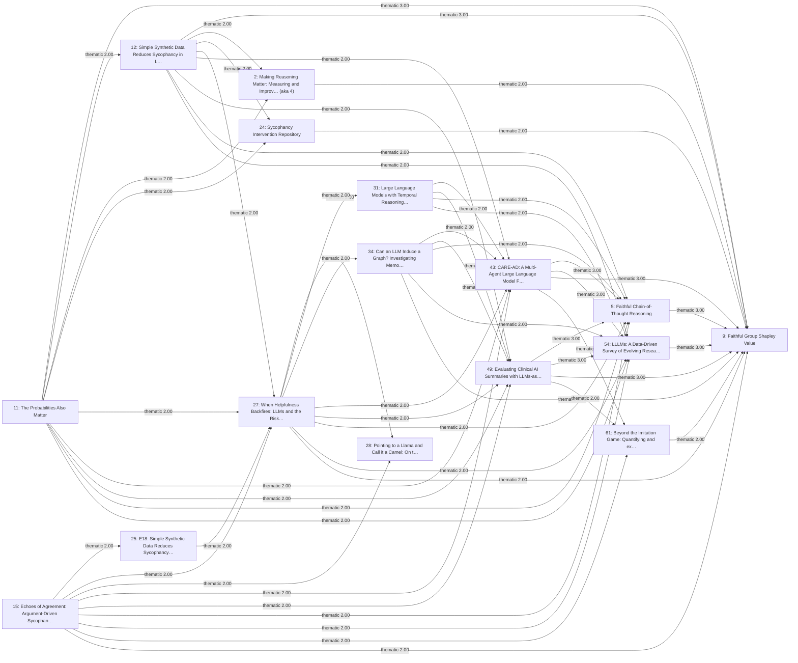

```mermaid
graph LR
  P2["2: Making Reasoning Matter: Measuring and Improv… (aka 4)"]
  P5["5: Faithful Chain-of-Thought Reasoning"]
  P9["9: Faithful Group Shapley Value"]
  P11["11: The Probabilities Also Matter"]
  P12["12: Simple Synthetic Data Reduces Sycophancy in L…"]
  P15["15: Echoes of Agreement: Argument-Driven Sycophan…"]
  P24["24: Sycophancy Intervention Repository"]
  P25["25: E18: Simple Synthetic Data Reduces Sycophancy…"]
  P27["27: When Helpfulness Backfires: LLMs and the Risk…"]
  P28["28: Pointing to a Llama and Call it a Camel: On t…"]
  P31["31: Large Language Models with Temporal Reasoning…"]
  P34["34: Can an LLM Induce a Graph? Investigating Memo…"]
  P43["43: CARE-AD: A Multi-Agent Large Language Model F…"]
  P49["49: Evaluating Clinical AI Summaries with LLMs-as…"]
  P54["54: LLLMs: A Data-Driven Survey of Evolving Resea…"]
  P61["61: Beyond the Imitation Game: Quantifying and ex…"]
  P11 -->|thematic 3.00| P9
  P12 -->|thematic 3.00| P9
  P43 -->|thematic 3.00| P5
  P43 -->|thematic 3.00| P54
  P43 -->|thematic 3.00| P9
  P49 -->|thematic 3.00| P5
  P49 -->|thematic 3.00| P54
  P49 -->|thematic 3.00| P9
  P5 -->|thematic 3.00| P9
  P54 -->|thematic 3.00| P9
  P11 -->|thematic 2.00| P12
  P11 -->|thematic 2.00| P2
  P11 -->|thematic 2.00| P24
  P11 -->|thematic 2.00| P27
  P11 -->|thematic 2.00| P43
  P11 -->|thematic 2.00| P49
  P11 -->|thematic 2.00| P5
  P11 -->|thematic 2.00| P54
  P12 -->|thematic 2.00| P2
  P12 -->|thematic 2.00| P24
  P12 -->|thematic 2.00| P27
  P12 -->|thematic 2.00| P43
  P12 -->|thematic 2.00| P49
  P12 -->|thematic 2.00| P5
  P12 -->|thematic 2.00| P54
  P15 -->|thematic 2.00| P25
  P15 -->|thematic 2.00| P27
  P15 -->|thematic 2.00| P28
  P15 -->|thematic 2.00| P43
  P15 -->|thematic 2.00| P49
  P15 -->|thematic 2.00| P5
  P15 -->|thematic 2.00| P54
  P15 -->|thematic 2.00| P61
  P15 -->|thematic 2.00| P9
  P2 -->|thematic 2.00| P9
  P24 -->|thematic 2.00| P9
  P25 -->|thematic 2.00| P27
  P27 -->|thematic 2.00| P28
  P27 -->|thematic 2.00| P31
  P27 -->|thematic 2.00| P34
  P27 -->|thematic 2.00| P43
  P27 -->|thematic 2.00| P49
  P27 -->|thematic 2.00| P5
  P27 -->|thematic 2.00| P54
  P27 -->|thematic 2.00| P9
  P31 -->|thematic 2.00| P43
  P31 -->|thematic 2.00| P49
  P31 -->|thematic 2.00| P5
  P31 -->|thematic 2.00| P54
  P34 -->|thematic 2.00| P43
  P34 -->|thematic 2.00| P49
  P34 -->|thematic 2.00| P5
  P34 -->|thematic 2.00| P54
  P34 -->|thematic 2.00| P9
  P43 -->|thematic 2.00| P61
  P49 -->|thematic 2.00| P61
  P61 -->|thematic 2.00| P9
```
